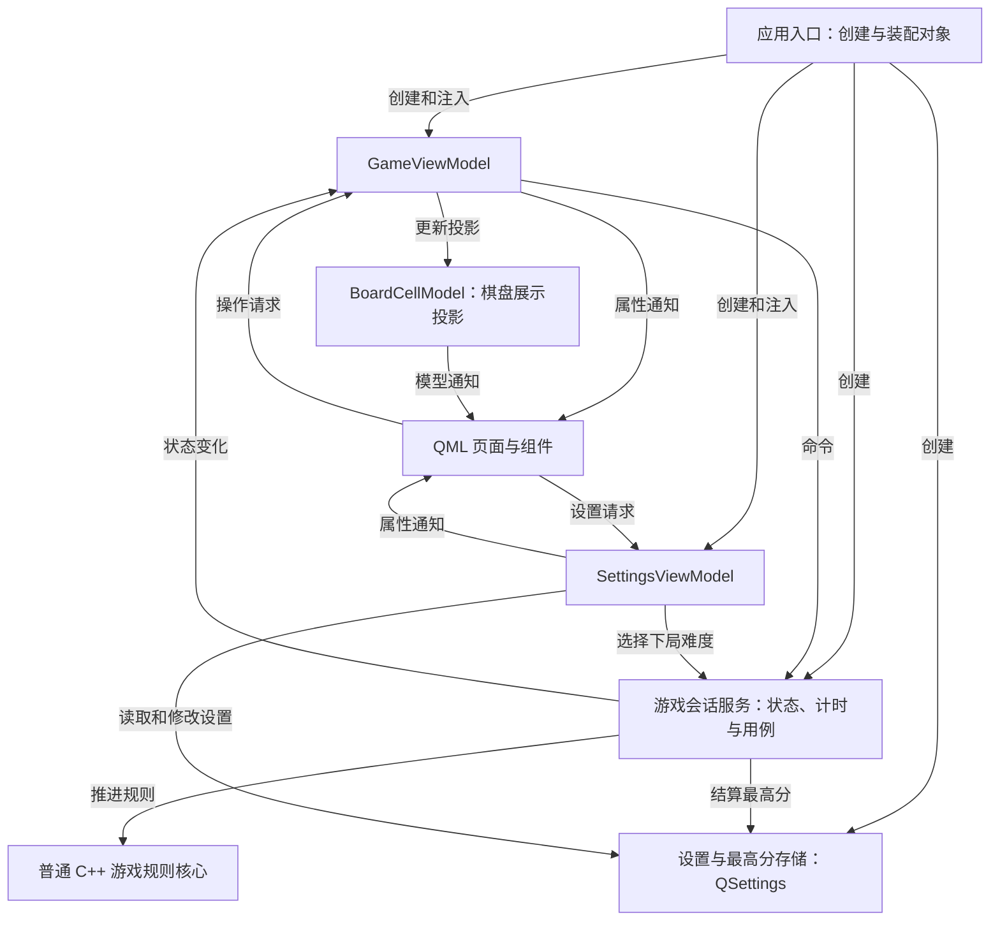

# Qt Snake Lab

以经典贪吃蛇为切入点，系统学习 **Qt 6、QML、C++ 与 MVVM** 的桌面练习项目。

项目不以开发速度为目标，而是走完交互原型、软件实现方案、源码结构设计、编码、测试和跨平台验收的完整过程。每个阶段都需要说明设计理由和验证结果，按验收推进，不设固定完成日期。

> **当前状态：阶段 1，交互原型评审通过。** 已交付可试玩的离线网页原型及交互说明。Qt 架构、接口、工程配置、源码和正式测试仍为未实施规划；当前没有可运行的 Qt 游戏。

直接打开 [交互原型](prototype/index.html) 即可试玩，无需安装依赖。评审路径与检查结果见 [贪吃蛇交互原型说明](docs/贪吃蛇交互原型说明.md)。

## 1. 学习目标与项目边界

### 学习目标

- 强化 QML 页面、组件拆分、布局、样式、属性绑定、信号和输入处理。
- 掌握 C++ 与 QML 的类型注册、`Q_PROPERTY`、`NOTIFY`、`Q_INVOKABLE` 和枚举暴露。
- 实践 MVVM：界面发送意图，ViewModel 暴露状态与命令，业务规则保持独立。
- 理解 `QAbstractListModel` 的角色、数据变化通知及其与 QML delegate 的关系。
- 掌握 QObject 所有权、会话状态机、计时器生命周期和本地持久化。
- 建立可重复构建、分层测试、持续集成和跨平台验收习惯。

关键学习链路是：

```text
键盘或按钮输入
    → QML 表达操作意图
    → ViewModel 命令
    → 会话服务及规则核心更新状态
    → 属性通知与展示模型更新
    → QML 绑定刷新界面
```

### 首版范围

经典贪吃蛇加完整应用流程：开始、暂停、继续、重开、返回首页、难度设置、本地最高分和结算。

首版不包含联网排行、存档续玩、障碍、穿墙、音效、移动端和其他游戏。后续扩展在首版验收后单独设计，不提前加入核心实现。

## 2. 技术基线与目标平台

| 项目 | 规划选择 |
| --- | --- |
| Qt | 6.8.3，两个目标平台使用同一基线 |
| 界面 | QML、Qt Quick、Qt Quick Controls |
| 业务与展示逻辑 | C++17、MVVM |
| 构建 | CMake、Ninja、Qt Creator |
| QML 模块 | 使用 `qt_add_qml_module` 组织 |
| 数据存储 | QSettings，保存难度和各难度最高分 |
| 自动测试 | Qt Test、Qt Quick Test、CTest |
| 开发与验收平台 | macOS arm64、银河麒麟 Linux x86_64 |
| 持续集成 | macOS 与通用 Linux；麒麟另做原生环境验收 |

后续 CMake 配置使用平台独立的构建目录。公共 `CMakePresets.json` 不写个人机器的 Qt 安装路径；个人路径放入不提交的 `CMakeUserPresets.json`。构建前核对 Qt Kit、编译器和目标架构，构建后核对产物架构。

## 3. 首版玩法与交互

### 页面与状态

界面采用**现代简洁街机风**：深色棋盘、亮色蛇身、醒目的食物、清晰网格和桌面操作控件。界面文案使用简体中文。

| 页面或状态 | 显示内容 | 主要操作 |
| --- | --- | --- |
| 首页 | 项目名称、所选难度、对应难度最高分、操作说明 | 开始游戏、选择难度 |
| 游戏界面 | 棋盘、分数、最高分、难度和操作提示 | 转向、暂停、重开、返回首页 |
| 暂停 | 保留棋盘，显示暂停提示 | 继续、重开、返回首页 |
| 结算 | 结束原因、本局分数、最高分 | 再玩一次、返回首页 |
| 操作确认 | 重开或返回首页的确认说明 | 确认、取消 |

页面导航属于展示状态，游戏生命周期属于会话状态，两者不得混用。例如首页对应尚未开始的会话，暂停与结算使用游戏界面上的覆盖层，不建立新的游戏状态副本。

### 默认规则

| 规则 | 首版约定 |
| --- | --- |
| 棋盘 | 固定 `20 × 20` 格；窗口缩放只改变显示尺寸 |
| 初始蛇 | 长度为 3，位于棋盘中央，初始向右移动 |
| 食物 | 每次只有一个，只生成在未被蛇占用的格子 |
| 成长与计分 | 每吃一个食物增长一格并得 10 分 |
| 结束条件 | 撞墙或撞身体结束，保留结束时的棋盘和分数 |
| 胜利条件 | 蛇填满棋盘后胜利，不再尝试生成食物 |
| 转向 | 禁止直接反向，每个移动周期只接受第一次有效转向 |
| 尾格处理 | 未增长时允许进入本步即将腾出的尾部格 |
| 最高分 | 按难度分别保存，结算时更新；持久化失败不影响继续游戏 |

| 难度 | 每步间隔 | 说明 |
| --- | --- | --- |
| 简单 | 240 ms | 速度较慢 |
| 普通 | 160 ms | 默认难度 |
| 困难 | 100 ms | 速度较快 |

难度仅在首页修改，本局速度固定，不随分数自动加速。无效方向请求不占用本周期的有效转向机会。

### 输入、焦点与确认

- 方向键或 WASD 转向，忽略键盘自动重复。
- 空格在运行和暂停之间切换；Esc 在运行时暂停。
- 首页、结算和确认弹窗不接收游戏转向，弹窗打开期间隔离游戏快捷键。
- 窗口失焦自动暂停；恢复焦点后由玩家主动继续。
- 本局尚未结束时，重开或返回首页先暂停并弹出确认；取消后保持暂停。
- 暂停时不推进规则，继续时重新等待一个完整移动间隔，不补执行暂停期间的移动。
- 游戏界面获得操作焦点后接收键盘输入，按钮和弹窗关闭后的焦点恢复纳入验收。

## 4. 从交互原型到软件设计

采用“**交互原型说明 → Qt 实现方案 → Qt 源码结构设计**”的交付层次：先确定用户看到和操作什么，再确定软件如何实现，最后明确文件、类型、接口与依赖关系。

阶段 1 的原型及交互说明已通过用户评审；两份 Qt 软件设计文档仍未实施，不创建空目录或占位文件：

| 计划交付物 | 计划位置 | 内容及通过条件 |
| --- | --- | --- |
| 离线交互原型 | [prototype/index.html](prototype/index.html) | 已制作：可试玩的首页、游戏、暂停、结算和确认流程；直接打开即可评审 |
| 贪吃蛇交互原型说明 | [docs/贪吃蛇交互原型说明.md](docs/贪吃蛇交互原型说明.md) | 已制作：页面结构、操作反馈、键盘与焦点规则、评审路径及实际检查结果 |
| 贪吃蛇 Qt 实现方案 | `docs/贪吃蛇Qt实现方案.md` | 技术基线、分层职责、状态流、玩法规则、持久化、实施顺序及每步验收 |
| 贪吃蛇 Qt 源码结构设计 | `docs/贪吃蛇Qt源码结构设计.md` | 文件职责、目标接口、模型角色、所有权、依赖、测试对应关系及关系图 |

原型仅用于交互评审，其模拟数据和逻辑独立于正式 C++ 游戏核心。原型通过后再完善两份软件设计文档，不将原型中的 JavaScript 游戏逻辑搬进 QML。

源码结构设计至少包含三类图：QML 文件装配关系、QML 与 ViewModel 绑定关系、主要 C++ 类型依赖与所有权关系。所有接口和文件使用“计划新增（未实现）”“已实施”等明确状态，不把目标设计写成当前代码事实。

## 5. MVVM 架构与职责



### 规则核心与会话

- **游戏规则核心**保存唯一的棋盘、蛇、方向、食物和分数，提供初始化、转向、单步推进和快照读取。使用普通 C++，不依赖 QObject、QML、QTimer 或真实时间。
- **游戏会话服务**唯一持有规则核心，管理 `Ready / Running / Paused / GameOver / Won`、QTimer、当前难度和结算。每次超时只推进一步，不追赶积压时间；终局停止计时，结算只执行一次。
- 返回首页清理本局并回到 `Ready`；重开或再玩一次以当前选择的难度重新初始化并进入 `Running`。
- 会话通过快照或状态事件向展示层提供事实，ViewModel 不拥有独立的蛇、碰撞规则或计分逻辑。

### 展示层与 QML

- **GameViewModel**提供状态、分数、当前难度、最高分、结束原因、操作可用条件和棋盘模型，转接开始、转向、暂停、继续、重开和返回首页命令。
- **SettingsViewModel**提供所选难度、各难度最高分及存储提示，不保存第二份游戏状态，不直接调用 GameViewModel。
- **BoardCellModel**使用 `QAbstractListModel` 将棋盘投影为 400 个格子，提供行、列和格子类型角色。格子类型至少区分空格、蛇头、蛇身和食物；模型不参与碰撞或计分。
- **QML**负责布局、样式、绑定、输入转发和纯视觉反馈；不得直接推进规则、操作 QSettings 或访问会话服务。
- 动态展示状态使用 `Q_PROPERTY + NOTIFY`，命令使用 `Q_INVOKABLE`，枚举注册到 QML。状态以只读属性暴露，设置修改使用显式命令。
- QML 根对象通过明确类型的属性接收 ViewModel，子组件通过属性接收依赖、通过信号表达操作请求，避免依赖隐含的全局上下文变量。

### 持久化与对象所有权

- 设置存储是难度和最高分的唯一持久化入口，使用 QSettings，两个平台采用稳定且相同的应用身份和键名约定。
- 设置缺失或无效时恢复默认难度和有效最高分；写入失败显示提示，内存状态继续可用，但不宣称已成功保存。
- 存储组件作为可替换依赖注入，测试使用内存存储或临时路径，不修改用户真实设置。
- 应用入口作为组合根，创建存储、会话和 ViewModel，并在加载 QML 前完成注入。ViewModel 借用会话和存储，GameViewModel 持有棋盘展示模型。
- 服务与 ViewModel 的生命周期长于 QML 根对象；退出时先销毁界面及展示层，再销毁服务与存储。具体对象创建和销毁契约在源码结构设计中明确。
- 首版在 GUI 线程中运行，棋盘规模不需要引入工作线程。

### 关键接口规划

以下为待设计和实现的能力边界，不代表已经存在的源码。阶段 2 确定具体签名、参数类型、返回值、通知信号和异常反馈，并在之后的实现中持续复核。

| 类型或边界 | 计划公开能力 | 主要验证点 |
| --- | --- | --- |
| 游戏规则核心 | 初始化、请求转向、单步推进、读取快照 | 确定性、转向限制、碰撞、增长与胜利 |
| 游戏会话服务 | 开始、暂停、继续、重开、返回首页、转向、读取状态 | 状态转换、计时生命周期、终局结算 |
| GameViewModel | 游戏展示属性、棋盘模型、游戏操作命令 | 属性通知、命令条件、状态与界面一致 |
| SettingsViewModel | 所选难度、各难度最高分、选择难度、存储提示 | 首页修改限制、跨实例恢复、存储失败 |
| BoardCellModel | 行数、行列及格子类型角色、投影更新 | roleNames、有效索引、通知与实际格子一致 |
| 设置存储 | 加载和保存难度、加载和更新最高分、报告失败 | 默认值、无效数据、失败提示、测试隔离 |

## 6. 预期源码目录

**下面是项目目标结构，不是当前仓库完整文件清单。** 当前已存在 `README.md`、`prototype/` 下三个网页原型文件，以及 `docs/贪吃蛇交互原型说明.md`；其余目录和文件仍在对应阶段真正实施时加入。

```text
qt-snake-lab/
├── README.md
├── docs/                       # 三份设计文档、验收记录、学习记录
├── prototype/                  # 离线交互原型
├── src/
│   ├── app/                    # 程序入口与对象装配
│   ├── domain/                 # 游戏规则、状态与值类型
│   ├── application/            # 会话、计时与用例
│   ├── presentation/           # ViewModel 与棋盘展示模型
│   └── infrastructure/         # 设置及最高分存储
├── qml/
│   ├── pages/                  # 首页与游戏界面
│   ├── components/             # 棋盘、计分、暂停与结算组件
│   └── theme/                  # 颜色、间距和样式
├── tests/
│   ├── cpp/                    # 规则、会话及 ViewModel 测试
│   └── qml/                    # 组件与交互测试
├── scripts/                    # 构建和平台验证辅助脚本
├── .github/
│   └── workflows/              # 持续集成
├── CMakeLists.txt
└── CMakePresets.json
```

工程基础阶段同步补充中文 `AGENTS.md`、贡献说明、变更记录、`.gitignore` 和 MIT 许可证。首次规划发布不创建这些文件；计划采用 MIT 不代表当前仓库已经附有许可证。

## 7. 分阶段实施与验收

| 阶段 | 状态 | 交付物 | 进入下一阶段的条件 |
| --- | --- | --- | --- |
| 0．规划发布 | 已完成 | 独立公开仓库和完整中文 README | Markdown、链接、规划状态、仓库可见性及远程文件核对通过 |
| 1．交互原型 | 已完成，用户评审通过 | 离线交互原型、交互原型说明 | 首页、游戏、暂停、结算、确认流程和窗口适配完成评审 |
| 2．软件设计 | 未实施 | Qt 实现方案、Qt 源码结构设计 | 分层职责、状态流、接口、所有权和测试方案相互一致 |
| 3．工程基础 | 未实施 | CMake 工程、QML 模块、主窗口、项目配置、基础 CI | 两个平台可构建启动，模块和资源加载正常 |
| 4．规则核心 | 未实施 | 可单步运行的游戏规则核心及测试 | 移动、转向、增长、碰撞、食物生成和胜利规则通过 |
| 5．MVVM 闭环 | 未实施 | 会话、ViewModel、棋盘模型和游戏界面 | 输入到状态通知的完整链路可运行，暂停与重开可靠 |
| 6．完整应用 | 未实施 | 首页、设置、最高分、结算和视觉完善 | 完整流程、持久化、失焦和错误提示通过验收 |
| 7．跨平台交付 | 未实施 | 两个平台运行记录和发布说明 | 原生构建、GUI、资源加载、分发和重启验证通过 |

### 每阶段的工作方式

1. 先阅读已确认的原型和设计，明确本阶段要练习的 Qt 概念。
2. 编码前更新受影响的接口契约，标记为待实现，并确认依赖和所有权。
3. 只实现本阶段所需能力，不依赖尚未交付的页面或功能。
4. 执行相关测试和已有功能回归；涉及界面的步骤同时检查真实 GUI。
5. 对照代码、绑定和测试修订文档，记录“练习了什么、为什么这样设计、如何验证”。
6. 验收通过后才更新状态并进入下一阶段；失败项保留现象、原因和后续处理记录。

原型阶段以交互评审为主；软件设计阶段以契约和依赖一致性为主；实现阶段以行为和测试证据为主。阶段记录写入后续 `docs/`，README 保留总体进度和入口。

## 8. 测试与跨平台验证计划

### 自动测试

| 层次 | 重点场景 | 验证方式 |
| --- | --- | --- |
| 游戏规则 | 移动、增长、计分、撞墙、撞身体、填满棋盘 | 固定输入和可读取快照 |
| 转向与边界 | 反向请求、无效输入、一个周期多次输入、尾格腾出 | 单步推进，不依赖键盘实机时序 |
| 食物生成 | 避开蛇身、只剩一个空格、满格不生成食物 | 固定随机种子或注入随机源 |
| 游戏会话 | 暂停不推进、恢复不补步、重开清理状态、终局计时停止和结算一次 | 手动推进或可控计时依赖 |
| ViewModel | 属性通知、按钮可用条件、命令转发、最高分及结束原因一致 | Qt Test、信号检查和可控服务 |
| 棋盘模型 | 初始角色、索引有效性、吃食物和移动后的格子更新 | 模型数据与规则快照对照 |
| 持久化 | 缺省值、无效值、按难度最高分、重新创建实例恢复、写入失败 | 内存存储和隔离的临时设置文件 |
| QML | 页面切换、暂停及结算覆盖层、绑定刷新、确认操作和输入隔离 | Qt Quick Test，注入可控 ViewModel |

测试不得修改用户真实最高分，不使用长时间等待来证明规则正确。Qt Test 和 Qt Quick Test 接入 CTest；QML 测试使用可控数据，不复制一份游戏规则来充当预期结果。

### GUI 与平台验收

- 在 `800 × 600` 和 `1280 × 800` 窗口检查棋盘、按钮、文本和覆盖层；缩放不改变逻辑棋盘。
- 检查键盘焦点、按钮点击后的输入恢复、弹窗输入隔离、窗口失焦暂停和主动继续。
- 走完开始、吃食物、暂停、继续、重开、返回首页、失败和胜利等评审路径。
- 检查设置与最高分在进程重启后恢复，以及持久化错误提示。
- macOS arm64 与麒麟 x86_64 分别原生配置、构建和启动，核对产物架构、QML 资源及运行依赖。
- macOS 与通用 Linux CI 负责构建和自动测试；通用 Linux 结果不替代银河麒麟原生验收。
- 分发阶段分别验证应用包或目录中的 Qt/QML 依赖和资源，记录 GUI 是否可启动；具体分发方式在阶段 2 的实现方案中确定。

当前已完成原型的 JavaScript 语法检查、19 项临时规则/会话断言，以及本机 HTTP 预览的浏览器试玩与交互检查，详见交互原型说明。双击离线文件和真实窗口失焦仍待人工确认；麒麟未实测。尚未建立 Qt 测试工程或 CI，未进行 Qt 游戏验收。后续记录继续区分“已自动验证”“已实机验证”和“未验证”。

## 9. 项目约定与后续扩展

### 项目约定

- README、设计文档、项目规则和用户界面使用简体中文，代码标识使用英文。
- 学习资料仓库保持独立，本仓库维护游戏项目的规划、原型、设计与实现。
- 设计采用参考项目的文档组织方法，公开仓库不复制私有业务内容、图片或内部路径。
- 文档中区分当前状态与目标设计；未生成的文件只在表格和目录规划中出现，不建立失效的文件链接。
- 每阶段按实际行为和验证结果更新契约，不以 Mock、原型或自动测试替代目标平台实机证据。
- 代码变更不主动提交，收到明确提交请求后使用 `git-cz`；Code Agent 执行的提交按全局约定记录真实 Agent 和完整模型标识。

### 首版之后的候选扩展

- 障碍模式、穿墙模式或可配置棋盘，练习规则扩展和配置隔离。
- 音效、纯视觉动画和主题切换，练习资源、样式与状态分离。
- 存档续玩或回放，练习状态序列化和确定性规则。
- 联网排行，练习网络请求、异步状态和错误反馈。
- Android 触摸控制与布局适配，练习移动端输入和打包。

以上均不属于首版承诺，新增前先制定交互和实现方案。

## 10. 学习资料与官方参考

### 配套学习资料

已有学习笔记整理在 [Qt 学习资料仓库](https://github.com/soapgu/qt_learn)：

- [Qt Quick/QML 学习资料](https://github.com/soapgu/qt_learn/blob/main/docs/QML学习资料.md)
- [Qt QML Signal 与分层事件流](https://github.com/soapgu/qt_learn/blob/main/docs/Qt%20QML%20Signal与分层事件流.md)
- [Qt Q_PROPERTY 与跨平台双向绑定对照](https://github.com/soapgu/qt_learn/blob/main/docs/Qt%20Q_PROPERTY与跨平台双向绑定对照.md)
- [Qt 元对象系统与 QML 类型注册](https://github.com/soapgu/qt_learn/blob/main/docs/Qt元对象系统与QML类型注册.md)
- [银河麒麟 Qt 6.8.3 环境安装操作手册](https://github.com/soapgu/qt_learn/blob/main/docs/银河麒麟Qt6环境安装操作手册.md)

### Qt 官方参考

- [C++ 属性、方法和信号暴露给 QML](https://doc.qt.io/qt-6.8/qtqml-cppintegration-exposecppattributes.html)
- [使用 qt_add_qml_module 组织 QML 模块](https://doc.qt.io/qt-6.8/qt-add-qml-module.html)
- [QAbstractListModel](https://doc.qt.io/qt-6.8/qabstractlistmodel.html)
- [Qt Test](https://doc.qt.io/qt-6.8/qttest-index.html)
- [Qt Quick Test](https://doc.qt.io/qt-6.8/qtquicktest-index.html)

官方链接使用 Qt 6.8 文档系列，网站可能显示该系列较新的补丁版；本项目规划的构建与验收基线仍为 Qt 6.8.3。
