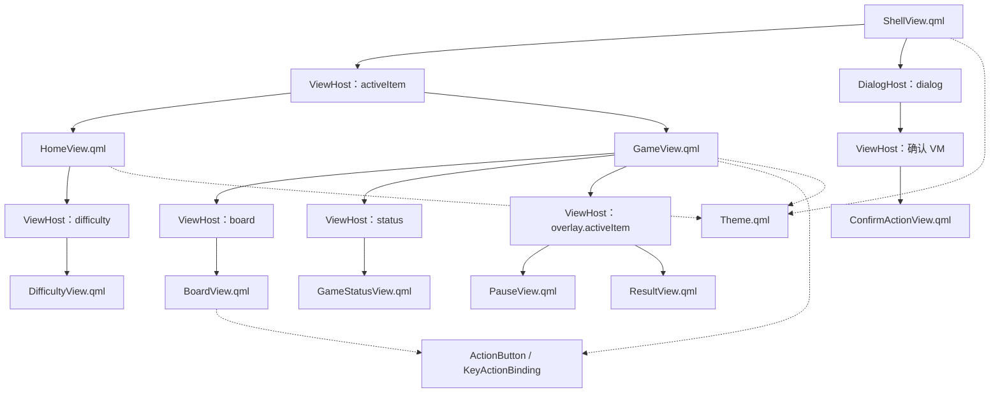
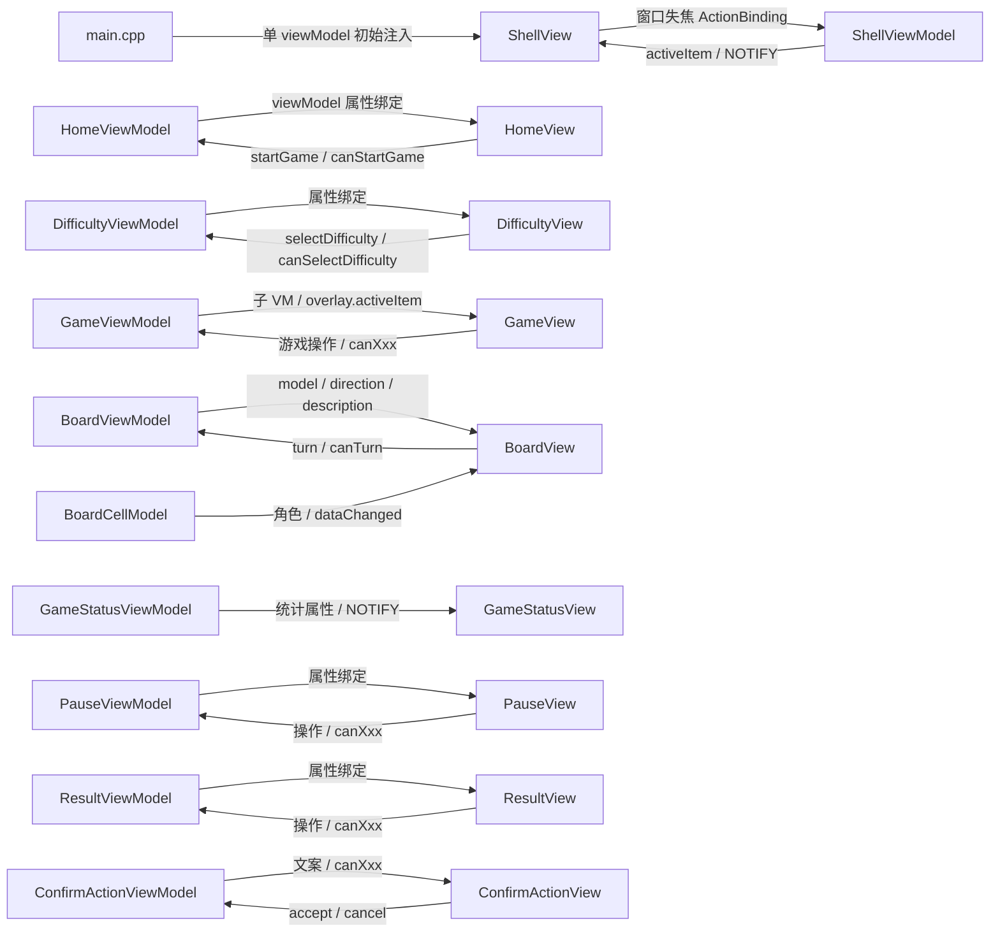
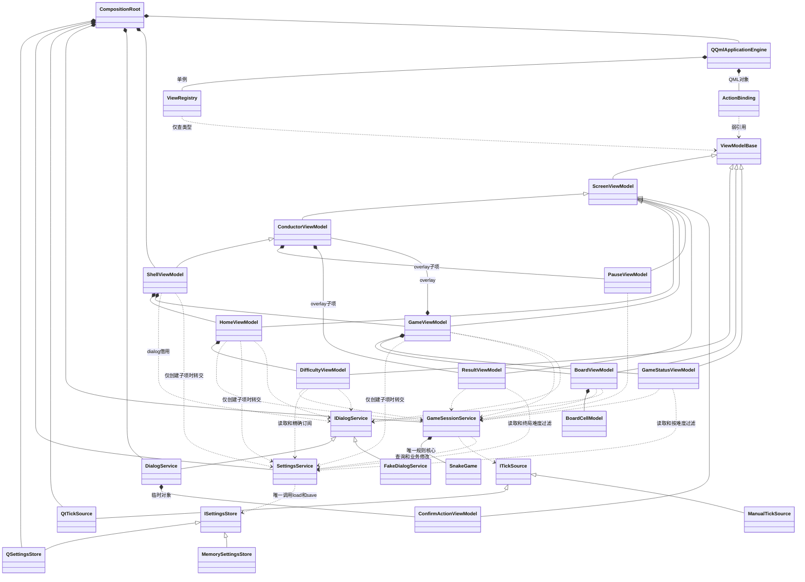

# 贪吃蛇 Qt 源码结构设计

## 1. 文档用途

本文记录目标文件、接口、通知、依赖和所有权；[Qt 实现方案](贪吃蛇Qt实现方案.md)管理行为、实施步骤与验收；[交互原型说明](贪吃蛇交互原型说明.md)保留原型事实与评审记录。

**软件设计已通过用户评审；以下全部 Qt 源码、QML、构建及测试文件均为“计划新增（未实现）”。** 当前没有 Qt 工程，本阶段不创建目录或占位源码。2026-09-30 已确认采用 CM 风格严格 MVVM，存储异常在内部处理，界面不提供相关提示。2026-10-01 已确认增加 SettingsService 并使用两类精确设置通知，存储只负责读写。

业务 View 与 ViewModel 按名称一一对应；父 VM 组合子 VM，QML 只声明单 VM 绑定和操作。Screen/Conductor/ActionBinding 等为本项目计划实现的最小支撑，不是 Qt 内置框架；不加入通用事件总线或控件引用到 ViewModel。

## 2. QML 文件

### 2.1 根窗口、页面与业务组件

| 文件 | 状态 | 职责 |
| --- | --- | --- |
| `qml/views/ShellView.qml` | 计划新增（未实现） | 根 ApplicationWindow；接收 ShellViewModel，装配活动页面 ViewHost 与 DialogHost，转发窗口活动变化。 |
| `qml/views/HomeView.qml` | 计划新增（未实现） | 首页；接收 HomeViewModel，装配 Difficulty 子 View，开始按钮声明 startGame 操作。 |
| `qml/views/DifficultyView.qml` | 计划新增（未实现） | 接收 DifficultyViewModel，显示三档、所选最高分及间隔，声明 selectDifficulty 操作。 |
| `qml/views/GameView.qml` | 计划新增（未实现） | 接收 GameViewModel，装配 Board、Status、overlay；声明游戏操作和空格/Esc 输入。 |
| `qml/views/BoardView.qml` | 计划新增（未实现） | 接收 BoardViewModel，以 Grid/Repeater 展示400格，方向/WASD绑定 turn，处理棋盘视觉焦点。 |
| `qml/views/GameStatusView.qml` | 计划新增（未实现） | 接收 GameStatusViewModel，只显示分数、最高分、蛇长、难度、间隔。 |
| `qml/views/PauseView.qml` | 计划新增（未实现） | 接收 PauseViewModel，显示暂停原因及继续/重开/返回操作。 |
| `qml/views/ResultView.qml` | 计划新增（未实现） | 接收 ResultViewModel，显示失败/胜利及再玩/返回操作。 |
| `qml/views/ConfirmActionView.qml` | 计划新增（未实现） | 接收 ConfirmActionViewModel，显示标题/说明及 accept/cancel，不访问游戏 VM。 |

### 2.2 通用绑定与主题

| 文件 | 状态 | 职责 |
| --- | --- | --- |
| `qml/mvvm/ViewHost.qml` | 计划新增（未实现） | 从 ViewRegistry 定位 View，以 Loader 初始属性注入 viewModel；处理默认焦点，不拥有 VM。 |
| `qml/mvvm/DialogHost.qml` | 计划新增（未实现） | 使用 Dialog 与 ViewHost 显示服务的弹窗 VM；模态隔离、取消/Esc、Tab循环、关闭后焦点恢复。 |
| `qml/mvvm/ActionButton.qml` | 计划新增（未实现） | Qt Quick Button 与 ActionBinding 的通用装配，enabled 和执行均来自绑定。 |
| `qml/mvvm/KeyActionBinding.qml` | 计划新增（未实现） | 识别声明的键、忽略自动重复，以原始 int 参数交给 ActionBinding；不判断会话状态。 |
| `qml/theme/Theme.qml` | 计划新增（未实现） | 模块内 QML 单例，统一颜色、间距、字号和视觉尺寸。 |

按钮、样式及格子 delegate 不另设业务 VM。所有业务 View 的唯一依赖为 `required property XxxViewModel viewModel`；其他只读视觉接口如 defaultFocusItem 不属于业务数据入口。

## 3. C++ 项目源码

### 3.1 入口与领域类型

| 文件 | 状态 | 职责 |
| --- | --- | --- |
| `src/app/main.cpp` | 计划新增（未实现） | 组合根；固定应用身份，创建依赖与 Shell，注册表定位根 View并注入，处理加载失败与退出次序。 |
| `src/domain/GameTypes.h` | 计划新增（未实现） | 普通 C++ 坐标、规则枚举、快照和单步结果，不依赖 Qt。 |
| `src/application/GameSessionTypes.h` | 计划新增（未实现） | 五种会话状态与暂停原因，独立于 QML 枚举桥接。 |
| `src/application/SettingsTypes.h` | 计划新增（未实现） | 设置记录和加载结果值类型：所选难度、三档最高分、可选解码字段及读取成功标记。 |

| 文件 | 状态 | 职责 |
| --- | --- | --- |
| `src/domain/SnakeGame.h` | 计划新增（未实现） | 声明随机索引函数和规则接口。 |
| `src/domain/SnakeGame.cpp` | 计划新增（未实现） | 实现初始化、转向、单步、增长、碰撞、食物及胜利；唯一保存规则数据。 |

### 3.2 应用服务

| 文件 | 状态 | 职责 |
| --- | --- | --- |
| `src/application/ITickSource.h` | 计划新增（未实现） | QObject 抽象单次计时接口，安排/取消及 timeout 信号。 |
| `src/application/ISettingsStore.h` | 计划新增（未实现） | 普通 C++ 抽象读写接口，仅虚析构、load 和 save，无应用缓存、业务修改或通知。 |

| 文件 | 状态 | 职责 |
| --- | --- | --- |
| `src/application/SettingsService.h` | 计划新增（未实现） | 声明 QObject 设置服务、查询/业务修改接口、精确通知和 Difficulty 元类型。 |
| `src/application/SettingsService.cpp` | 计划新增（未实现） | 实现唯一缓存、默认值与业务校验、最高分计算、保存组织、未保存标记及两类通知。 |
| `src/application/GameSessionService.h` | 计划新增（未实现） | 声明会话用例、只读事实与 sessionChanged。 |
| `src/application/GameSessionService.cpp` | 计划新增（未实现） | 实现唯一持有规则核心，检查状态、驱动计时及终局结算一次。 |

### 3.3 基础设施

| 文件 | 状态 | 职责 |
| --- | --- | --- |
| `src/infrastructure/QtTickSource.h` | 计划新增（未实现） | 声明ITickSource 的 QTimer 单次实现。 |
| `src/infrastructure/QtTickSource.cpp` | 计划新增（未实现） | 实现替换/取消安排与超时，不推进游戏。 |
| `src/infrastructure/QSettingsStore.h` | 计划新增（未实现） | 声明普通 C++ 存储实现、生产身份及隔离 INI 路径构造，无 QObject 父对象参数。 |
| `src/infrastructure/QSettingsStore.cpp` | 计划新增（未实现） | 实现严格字段解码、序列化、四键全量读写和内部诊断；无应用缓存或最高分计算。 |

### 3.4 展示层与 MVVM 支撑

| 文件 | 状态 | 职责 |
| --- | --- | --- |
| `src/presentation/GameEnumsQml.h` | 计划新增（未实现） | 注册 GameEnums，暴露状态/方向/难度/结束原因/暂停原因/格子类型，不包含确认操作枚举。 |
| `src/presentation/mvvm/ConfirmationRequest.h` | 计划新增（未实现） | 弹窗文案值类型和异步完成函数约定。 |
| `src/presentation/mvvm/IDialogService.h` | 计划新增（未实现） | 一个当前弹窗、异步 confirm、按请求者取消；抽象弹窗服务接口。 |

| 文件 | 状态 | 职责 |
| --- | --- | --- |
| `src/presentation/mvvm/ViewModelBase.h` | 计划新增（未实现） | 声明QObject 展示基类及不可创建的 QML 类型。 |
| `src/presentation/mvvm/ViewModelBase.cpp` | 计划新增（未实现） | 实现共享展示类型基础，不提供游戏逻辑。 |
| `src/presentation/mvvm/ScreenViewModel.h` | 计划新增（未实现） | 声明初始化/激活/停用及 isInitialized/isActive 通知。 |
| `src/presentation/mvvm/ScreenViewModel.cpp` | 计划新增（未实现） | 实现一次初始化与幂等生命周期，提供受保护生命周期钩子。 |
| `src/presentation/mvvm/ConductorViewModel.h` | 计划新增（未实现） | 声明子 Screen 所有权和唯一 activeItem。 |
| `src/presentation/mvvm/ConductorViewModel.cpp` | 计划新增（未实现） | 实现注册子项，先停用旧项再激活新项，可保持空活动项。 |
| `src/presentation/mvvm/ViewRegistry.h` | 计划新增（未实现） | 声明类型到 View 的固定注册与 QML 单例入口。 |
| `src/presentation/mvvm/ViewRegistry.cpp` | 计划新增（未实现） | 实现九对 VM/View 映射、根入口共用查询及缺失映射诊断。 |
| `src/presentation/mvvm/ActionBinding.h` | 计划新增（未实现） | 声明target/action/arguments、enabled、execute。 |
| `src/presentation/mvvm/ActionBinding.cpp` | 计划新增（未实现） | 实现方法与 canXxx 校验、通知监听、执行前重查及断开旧绑定。 |
| `src/presentation/mvvm/DialogService.h` | 计划新增（未实现） | 声明IDialogService 实现与临时弹窗生命周期。 |
| `src/presentation/mvvm/DialogService.cpp` | 计划新增（未实现） | 实现创建 Confirm VM、一次结果、弱请求者、取消失效及排队完成。 |

| 文件 | 状态 | 职责 |
| --- | --- | --- |
| `src/presentation/ShellViewModel.h` | 计划新增（未实现） | 声明根 Conductor、dialog 及窗口失焦操作。 |
| `src/presentation/ShellViewModel.cpp` | 计划新增（未实现） | 实现创建 Home/Game、C++导航连接及服务弹窗入口投影。 |
| `src/presentation/HomeViewModel.h` | 计划新增（未实现） | 声明首页 Screen、Difficulty 子项及开始操作。 |
| `src/presentation/HomeViewModel.cpp` | 计划新增（未实现） | 实现首页激活与开始用例，成功发 gameStarted 意图。 |
| `src/presentation/DifficultyViewModel.h` | 计划新增（未实现） | 声明只读设置展示及选择操作。 |
| `src/presentation/DifficultyViewModel.cpp` | 计划新增（未实现） | 实现共享会话/设置服务读取、精确通知过滤、首页交互条件、通知及枚举校验。 |
| `src/presentation/GameViewModel.h` | 计划新增（未实现） | 声明游戏 Screen、Board/Status/overlay 与游戏操作。 |
| `src/presentation/GameViewModel.cpp` | 计划新增（未实现） | 实现子 VM 组合、会话到覆盖层映射、确认交互锁和异步后续操作。 |
| `src/presentation/BoardViewModel.h` | 计划新增（未实现） | 声明棋盘模型入口、方向/说明、转向操作。 |
| `src/presentation/BoardViewModel.cpp` | 计划新增（未实现） | 实现快照投影、输入条件及方向参数校验。 |
| `src/presentation/GameStatusViewModel.h` | 计划新增（未实现） | 声明只读本局统计与通知。 |
| `src/presentation/GameStatusViewModel.cpp` | 计划新增（未实现） | 实现从共享会话/设置服务投影统计，并按难度过滤最高分通知。 |
| `src/presentation/PauseViewModel.h` | 计划新增（未实现） | 声明暂停 Screen、文案与操作意图。 |
| `src/presentation/PauseViewModel.cpp` | 计划新增（未实现） | 实现读取暂停事实和父级操作可用条件，发具名意图。 |
| `src/presentation/ResultViewModel.h` | 计划新增（未实现） | 声明结算 Screen、胜负文案/分数及操作意图。 |
| `src/presentation/ResultViewModel.cpp` | 计划新增（未实现） | 实现终局展示、匹配难度最高分通知、父级可用条件与再玩/返回意图。 |
| `src/presentation/ConfirmActionViewModel.h` | 计划新增（未实现） | 声明独立弹窗 Screen、文案、accept/cancel及 finished。 |
| `src/presentation/ConfirmActionViewModel.cpp` | 计划新增（未实现） | 实现一次结果及守卫；不引用游戏会话。 |
| `src/presentation/BoardCellModel.h` | 计划新增（未实现） | 声明固定400行、模型角色及 applySnapshot。 |
| `src/presentation/BoardCellModel.cpp` | 计划新增（未实现） | 实现格子投影与变化通知，不判断规则或计分。 |

## 4. 目标关键契约（待实现）

方法默认处于 snake 命名空间。全部契约待实现；常量入口使用 CONSTANT，其余表内只读动态属性均使用 READ 和 `<property>Changed()` NOTIFY，值变化才通知。命令均显式暴露，属性不提供业务 WRITE。

### 4.1 值类型、枚举与组合根

| 对象 | 目标关键契约 | 输入、输出与所有权 |
| --- | --- | --- |
| `Cell` | `int x`、`int y`；相等比较 | 零基坐标，合法棋盘范围 0～19；无 QObject |
| `Direction / Difficulty` | `Up, Down, Left, Right` / `Easy, Normal, Hard` | 普通 C++ `enum class`；无效枚举输入拒绝 |
| `EndReason / StepOutcome` | `None, WallCollision, SelfCollision, BoardFilled` / `NoChange, Moved, Ate, Lost, Won` | EndReason 为规则终局事实；NoChange 用于未初始化或已终局推进 |
| `GameSnapshot` | `int width=20, height=20`；`std::vector<Cell> snake`（头到尾）；`Direction direction=Right`；`std::optional<Cell> food`；`int score=0`；`EndReason endReason=None` | 值类型；空蛇表示未初始化/已清理，满格终局无食物；不含会话或弹窗状态 |
| `StepResult` | `StepOutcome outcome`、`EndReason endReason` | 单步结果；碰撞不提交非法蛇格，终局后 NoChange 保留结束原因 |
| `SessionState / PauseReason` | `Ready, Running, Paused, GameOver, Won` / `None, User, WindowInactive, Confirmation` | 属于应用层；暂停原因不会进入规则核心 |
| `SettingsRecord` | `Difficulty selectedDifficulty=Normal`；`std::array<int, 3> highScores{0,0,0}` | 数组明确按 Easy、Normal、Hard 排列；由 SettingsService 持有唯一可修改记录，读取返回副本 |
| `SettingsLoadResult` | `std::optional<Difficulty> selectedDifficulty`；`std::array<std::optional<int>,3> highScores{}`；`bool success=true` | 无 Qt 的值类型；最高分数组按 Easy/Normal/Hard 排列；缺失/无法解码字段为空，读盘失败 success=false 但保留已取得字段；成功缺省读取允许全部为空 |
| `GameEnumsQml` | QObject；`QML_NAMED_ELEMENT(GameEnums)`、`QML_UNCREATABLE`；各嵌套枚举使用 `Q_ENUM` | 领域/会话枚举与桥接枚举逐值映射，不依赖整数值巧合；不持有业务数据 |

桥接采用嵌套 enum class：State、Direction、Difficulty、EndReason、PauseReason、CellType；CellType 为 Empty/Head/Body/Food。声明 Q_CLASSINFO("RegisterEnumClassesUnscoped", "false")，QML 使用 GameEnums.State.Running 等带枚举名常量；VM 声明 RegisterEnumsFromRelatedTypes=false，普通 C++ 层不包含桥接头文件。QML 操作 int 参数严格校验再转领域枚举，不依赖枚举整数值巧合。[Qt 枚举说明](https://doc.qt.io/qt-6.8/qtqml-cppintegration-data.html)

main.cpp 按“QSettingsStore → SettingsService → QtTickSource → GameSessionService → DialogService → ShellViewModel → QQmlApplicationEngine”构造局部 RAII 对象，反序销毁，顶层 QObject 无父对象。SettingsService.load 在构造会话前调用；服务借用存储，寿命长于会话与所有 VM，存储长于服务。普通 C++ 存储不设置 QObject 父对象。暴露的 C++ VM/模型为 CppOwnership，ViewRegistry 单例由引擎拥有且不持有 VM。堆上子 VM/模型用 QObject 父对象唯一持有；QtTickSource 值成员 QTimer 不设父对象。

组合根在加载前调用 shell.initialize() 和 shell.activate()，使首页成为活动项。Shell 用同一注册表的 ViewRegistry::viewUrl(&shell) 定位根；引擎 setInitialProperties({viewModel: &shell}) 后 load(url)，失败非零退出。QML 模块 QtSnakeLab 1.0，RESOURCE_PREFIX=/qt/qml，各文件显式资源别名，目标 URI 为 qrc:/qt/qml/QtSnakeLab/views/XxxView.qml。构建需逐项验证映射 URI 与实际资源一致。

### 4.2 规则核心

| 对象 | 目标关键契约 | 输入、输出与前置条件 |
| --- | --- | --- |
| `SnakeGame` | `using RandomIndex = std::function<std::size_t(std::size_t)>`；`explicit SnakeGame(RandomIndex randomIndex)` | 核心持有函数对象；输入 n>0，函数必须返回 [0,n) 索引；生产 lambda 按值捕获已播种的 mt19937，不借用栈外随机引擎 |
| `SnakeGame` | `void initialize()`、`void clear()` | initialize 创建固定初始蛇并放食物；两者清空待转向及结束原因，clear 返回空蛇快照 |
| `SnakeGame` | `bool requestDirection(Direction direction)` | 活动且非终局时接受第一次有效请求；同向、反向、无效值及待转向已存在返回 false，不消费额外机会 |
| `SnakeGame` | `StepResult step()` | 消费待转向，计算增长/碰撞再提交合法移动；碰撞保存尝试方向但保留合法蛇格、食物及分数；满格返回 Won |
| `SnakeGame` | `GameSnapshot snapshot() const` | 返回值副本，只读事实；不提供可写引用、外部改分或公开载入任意快照的入口 |

核心无 QObject、QTimer 或 QML 依赖。测试用固定 RandomIndex 和仅测试使用的 `SnakeGameTestAccess` 构造尾格、身体碰撞和满格前一刻；访问器通过核心的 friend 声明访问私有状态，不成为产品 API。正常夹具满足食物不占蛇格、分数和长度一致等不变量；“增长时尾格仍参与碰撞”可单独检查碰撞判定范围，不能伪装成食物在尾格的合法游戏状态。

### 4.3 会话服务与计时

| 对象 | 目标关键契约 | 输入、输出与前置条件 |
| --- | --- | --- |
| `ITickSource` | QObject 抽象接口；`virtual void arm(int delayMs)=0`、`virtual void disarm()=0`、`virtual bool armed() const=0`；信号 `void timeout()` | arm 仅接受正间隔，替换旧安排；disarm 幂等；超时先清除 armed，再同步发一次信号；旧安排取消后不能补发 |
| `QtTickSource` | `explicit QtTickSource(QObject *parent=nullptr)`；实现上述接口 | 持有单次、PreciseTimer 类型的 QTimer；同 GUI 线程直接连接 timeout，不使用排队连接或累计补步 |
| `GameSessionService` | `GameSessionService(SettingsService &settings, ITickSource &clock, SnakeGame::RandomIndex randomIndex, QObject *parent=nullptr)` | 引用非空且长于会话；按值持有唯一 SnakeGame，初态 Ready，不自动开始 |
| `GameSessionService` | `SessionState state() const`、`GameSnapshot snapshot() const`、`Difficulty difficulty() const`、`int intervalMs() const`、`EndReason endReason() const`、`PauseReason pauseReason() const` | Ready 的 difficulty 读取 SettingsService 的所选难度，其余读取本局固定难度；intervalMs 按该难度计算；Ready 快照为空，结束/暂停原因为 None |
| `GameSessionService` | `bool start()`、`bool selectDifficulty(Difficulty difficulty)` | 仅 Ready；start 初始化并安排完整间隔；selectDifficulty 校验枚举并调用 SettingsService.setSelectedDifficulty，保存失败仍返回 true（请求已接受）；只有所选难度实际变化才发 sessionChanged，同档保存/重试不发 |
| `GameSessionService` | `bool requestDirection(Direction direction)` | 仅 Running，返回核心是否接受；不重置计时，不在请求时更新已提交方向 |
| `GameSessionService` | `bool pause(PauseReason reason)`、`bool resume()` | pause 仅 Running 且 reason 非 None/无效值；保留待转向并停止计时；resume 仅 Paused，清除暂停原因并等待完整间隔 |
| `GameSessionService` | `bool restart()`、`bool returnHome()` | 仅 Paused/GameOver/Won；restart 清理并按所选难度进入新局；returnHome 清理并回 Ready；不结算放弃的局 |
| `GameSessionService` | 信号 `void sessionChanged()` | 完整会话事实提交后同步发出；转向请求暂存但未提交时不发；调用 SettingsService.recordScore 前已提交终局并设置结算保护 |

未接受命令返回 false，不改变状态、核心、存储或调度。会话内部超时处理不公开为命令，仅接收 ITickSource 信号；非 Running 时忽略。每局开始重置结算保护，终局调用一次 `SettingsService::recordScore()` 后无下一步调度。暂停/清理不提高最高分。

**学习重点**：QTimer 是基础设施，会话是用例，SnakeGame 是规则。同一条移动可以由真实计时或手动测试触发；测试无需等待 100～240 ms。取消保证由 ITickSource 契约提供，生产实现与测试替身都必须遵守。

### 4.4 SettingsService、读写接口与精确通知

| 类型或成员 | 签名与通知 | 参数、返回及前置条件 |
| --- | --- | --- |
| SettingsService | `explicit SettingsService(ISettingsStore &store, QObject *parent=nullptr)` | QObject 应用服务，借用长于自己的存储；构造时缓存为普通难度/零分，不自动读盘；不注册为 QML 服务 |
| SettingsService | `void load()` | 组合根在会话/VM 构造前调用；首次读取所有字段、校验并完整提交记录后通知实际变化；不主动写盘，重复调用无操作 |
| SettingsService | `SettingsRecord records() const`；`Difficulty selectedDifficulty() const`；`int highScore(Difficulty difficulty) const` | 返回完整记录副本/查询值，无可写引用；highScore 的参数必须为合法难度 |
| SettingsService | `bool setSelectedDifficulty(Difficulty difficulty)` | 仅初始化完成后调用；合法值先提交内存并尝试全量保存，即使同档也可保存；返回请求接受，不受写盘失败影响；无效枚举 false 且无副作用 |
| SettingsService | `bool recordScore(Difficulty difficulty, int score)` | 仅初始化完成后调用；难度合法、分数0～3970且为10倍数；最高分取max，提高记录或有未保存数据时保存，否则不写盘；合法返回true，非法false无副作用 |
| SettingsService | `void selectedDifficultyChanged()`；`void highScoreChanged(Difficulty difficulty)` | 难度实际改变发前者；某档最高分实际改变发后者；不提供聚合通知，重复选择/未提高成绩/纯保存重试不发数据变化信号 |
| ISettingsStore | `virtual ~ISettingsStore()=default`；`virtual SettingsLoadResult load()=0`；`virtual bool save(const SettingsRecord &records)=0` | 普通 C++ 抽象接口；load只解码/读盘，save只序列化/写盘，bool表示持久化成功；无QObject、缓存、业务方法或通知 |
| QSettingsStore | `QSettingsStore()`；`explicit QSettingsStore(const QString &iniFilePath)` | 普通 C++ 实现，生产身份 soapgu / QtSnakeLab、NativeFormat/UserScope；测试仅指定 INI，禁用回退；无QObject父对象参数 |

服务拥有唯一记录、启动加载标记与未保存标记。存储负责严格解码，缺失或无法解码为空；布尔、小数、不完整整数文本和 int 溢出拒绝，难度字符串只映射 easy/normal/hard。服务处理业务范围、10分倍数、缺省与最高分计算，逐字段保留合法值；读盘失败仍使用可读合法字段和默认值继续初始化。首次 load 的分数从默认0变为有效值也发对应 highScoreChanged。

修改先完整提交缓存，再完成必要保存尝试，最后发送实际变化通知；初次加载同样先提交全部字段再通知。通知回调读取任何字段均得到新记录。写失败保留内存与未保存标记，不抑制通知；下一次正常选择难度或终局 recordScore 写出全份缓存，成功清标记；纯重试不发数据变化通知。

QSettingsStore 仅写实现方案3.3的四个键并保留其他键，每次操作创建局部 QSettings，保持原子同步要求、关闭回退，保存后sync/status检查。存储作读写诊断，服务内部处理加载失败及保存标记；没有界面提示、故障通知、后台重试或通用事件体系。

Difficulty 元类型在 SettingsService.h 的应用层、snake 命名空间外用 Q_DECLARE_METATYPE(snake::Difficulty) 声明，信号测试在创建 QSignalSpy 前调用 qRegisterMetaType<snake::Difficulty>() 登记，领域头不引入 Qt。业务枚举与 QML 枚举桥接仍按原有逐值映射；服务信号不使用展示层枚举。

| 订阅者 | SettingsService 信号 | 精确同步规则 |
| --- | --- | --- |
| DifficultyViewModel | selectedDifficultyChanged | 更新选择、中文名称、间隔及所选最高分；不刷新三档固定成绩 |
| DifficultyViewModel | highScoreChanged(difficulty) | 只更新对应档位成绩；与所选档匹配才更新 selectedBestScore |
| GameStatusViewModel | highScoreChanged(difficulty) | 只在与当前会话展示难度匹配时读取并更新 bestScore |
| ResultViewModel | highScoreChanged(difficulty) | 会话 GameOver/Won 且难度匹配才更新 bestScore，其他通知忽略 |

GameStatus/Result 仍订阅 sessionChanged，在会话变化时同步本局信息和对应最高分；设置通知只处理相关成绩。父级 VM 只转交服务引用以创建子项，不代替子 VM 订阅；QML 继续只绑定 VM 的属性通知。

### 4.5 MVVM 生命周期与操作绑定

下表类型均为 QObject；ViewModelBase、ScreenViewModel、ConductorViewModel 用 QML_ELEMENT + QML_UNCREATABLE，所有业务 VM 继承它们并按完整类名注册为不可创建类型。

| 类型 | 目标接口、属性与信号 | 前置条件与所有权 |
| --- | --- | --- |
| ViewModelBase | explicit ViewModelBase(QObject *parent=nullptr) | 公共 QObject 展示基类，不持有 View 或服务定位器 |
| ScreenViewModel | bool isInitialized / isActive；void initialize()；void activate()；void deactivate(bool close=false) | 生命周期为 C++ API；初始化一次、激活/停用幂等；受保护 onInitialize/onActivate/onDeactivate(bool) 钩子；close 不隐式删除对象 |
| ConductorViewModel | ScreenViewModel *activeItem（NOTIFY activeItemChanged）；void addItem(ScreenViewModel*)；bool activateItem(ScreenViewModel*) | addItem 接管堆对象父所有权，拒绝已有其他父对象；activateItem 仅接受已登记项或 nullptr，非法 false；同项幂等 |
| ConductorViewModel | 生命周期钩子与活动项管理 | 活动 Conductor 切换先 deactivate 旧项、提交 activeItem、activate 新项后通知；停用停用当前项但保留选择，重激活再激活它；不活动时只选定项不激活 |
| ViewRegistry | static QUrl viewUrl(const ViewModelBase*)；Q_INVOKABLE QUrl resolve(ViewModelBase*) const | QML_ELEMENT + QML_SINGLETON；固定九对映射，nullptr 无 View；未知类型诊断/无效URL；不可变、无 VM 所有权 |
| ActionBinding | ViewModelBase *target；QString action；QVariantList arguments（可写，各自NOTIFY）；bool enabled（只读NOTIFY）；Q_INVOKABLE void execute() | QML_ELEMENT，可创建；以弱 QObject 指针借用 target，销毁后禁用；更新配置断开旧守卫连接再验证 |
| ActionBinding | 对应 public Q_INVOKABLE void action() 或 action(int)；bool canXxx 属性及 NOTIFY | 无重载，参数数量/类型严格匹配；守卫名为 can+首字母大写action，缺失配置诊断且禁用；连接NOTIFY重算enabled，execute重读守卫再调用 |

Conductor 的子项保留直到所有者析构，普通页面切换不销毁 Home/Game，覆盖层切换不销毁 Pause/Result。订阅依赖在构造/初始化时建立一次，激活时刷新而不重复连接。生命周期不能作为开始、暂停或结束游戏的替代操作。[CM 组合说明](https://caliburnmicro.com/documentation/composition)

**操作声明示例（待实现）**：

```cpp
Q_PROPERTY(bool canPauseGame READ canPauseGame NOTIFY canPauseGameChanged)
public:
    bool canPauseGame() const;
    Q_INVOKABLE void pauseGame();
signals:
    void canPauseGameChanged();
```

```qml
ActionButton {
    text: "暂停"
    target: viewModel
    action: "pauseGame"
}
```

按钮不在业务 onClicked 中判断状态；ActionButton 的通用实现调用 binding.execute。无参数和单 int 参数统一走元对象调用；操作不返回 View 或同步弹窗结果。参数的合法领域值仍由 VM 校验，服务复核业务前置条件。[CM 操作与守卫](https://caliburnmicro.com/documentation/actions)

### 4.6 Shell、Home 与 Difficulty

| 类型 | 构造与持有 | 只读属性与通知 |
| --- | --- | --- |
| ShellViewModel : ConductorViewModel | ShellViewModel(GameSessionService&,SettingsService&,IDialogService&,QObject *parent=nullptr)；持有 Home/Game | 继承 activeItem；ConfirmActionViewModel *dialog（借用服务当前对象，dialogChanged）；bool canWindowDeactivated |
| HomeViewModel : ScreenViewModel | HomeViewModel(GameSessionService&,SettingsService&,IDialogService&,QObject *parent=nullptr)；持有 Difficulty | DifficultyViewModel *difficulty（CONSTANT）；bool canStartGame |
| DifficultyViewModel : ViewModelBase | DifficultyViewModel(GameSessionService&,SettingsService&,IDialogService&,QObject *parent=nullptr)；借用依赖 | selectedDifficulty（GameEnumsQml::Difficulty）、selectedDifficultyName（QString）、selectedIntervalMs（int）、easyBestScore/normalBestScore/hardBestScore/selectedBestScore（int）、canSelectDifficulty（bool） |

| 操作或协作 | 方法与信号 | 条件与结果 |
| --- | --- | --- |
| Shell | Q_INVOKABLE void windowDeactivated() | canWindowDeactivated=活动页为 Game 且 Game 可失焦暂停；转发暂停用例，不调用 QML 焦点接口 |
| Home | Q_INVOKABLE void startGame()；void gameStarted() | canStartGame=isActive、Ready、弹窗不忙；服务 start 成功才发意图；Shell 在 C++ 连接并 activateItem(Game) |
| Difficulty | Q_INVOKABLE void selectDifficulty(int difficulty) | canSelectDifficulty=父首页活动、Ready、弹窗不忙；校验枚举后经会话保存；保存失败仍展示内存选择 |
| Home→Difficulty | void setInteractionEnabled(bool)（仅 C++） | 首页激活/停用更新内部交互标记及守卫，不让隐藏页面操作；设置数据从 SettingsService 两类精确信号同步，无可修改成绩副本 |

Shell 初始化选 Home，激活 Shell 后激活 Home；Game 的 homeRequested 意图成功后由 Shell 切回 Home。同级 VM 不导航彼此，不引入第二个导航服务。

### 4.7 Game、Board 与 GameStatus

| 类型 | 构造与持有 | 只读属性与通知 |
| --- | --- | --- |
| GameViewModel : ScreenViewModel | GameViewModel(GameSessionService&,SettingsService&,IDialogService&,QObject *parent=nullptr)；持有 Board/Status/overlay | BoardViewModel *board、GameStatusViewModel *status、ConductorViewModel *overlay（均CONSTANT）；canPauseGame/canResumeGame/canTogglePauseGame/canRestartGame/canGoHome/canPauseForWindowInactive（bool） |
| BoardViewModel : ViewModelBase | BoardViewModel(GameSessionService&,IDialogService&,QObject *parent=nullptr)；持有唯一 BoardCellModel | BoardCellModel *model（CONSTANT）；direction（GameEnumsQml::Direction）、description（QString）、canTurn（bool） |
| GameStatusViewModel : ViewModelBase | GameStatusViewModel(GameSessionService&,SettingsService&,QObject *parent=nullptr)；借用依赖 | score/bestScore/snakeLength/intervalMs（int）、difficulty（GameEnumsQml::Difficulty）、difficultyName（QString） |

Game 守卫均要求 isActive 且无内部 interactionPending、无服务 busy；暂停/失焦暂停另要求 Running，继续要求 Paused，切换暂停要求 Running或Paused，重开/返回要求非Ready。Board.canTurn 要求父 Game 活动、无交互锁、无模态且会话 Running。内部 setInteractionEnabled(bool) 在 C++ 同步父交互条件，不暴露给 QML。

| Game 操作（Q_INVOKABLE void） | 前置条件 | 行为 |
| --- | --- | --- |
| pauseGame() / resumeGame() | 各自 canXxx | 调用 pause(User) / resume，服务再次验证 |
| togglePauseGame() | canTogglePauseGame | 按服务状态选择暂停或继续，QML 不选择业务分支 |
| pauseForWindowInactive() | canPauseForWindowInactive | 调用 pause(WindowInactive)，已暂停不覆盖原因，不请求焦点 |
| restartGame() / goHome() | 各自 canXxx | Running先 pause(Confirmation)，Paused保留原因，异步确认；终局直接执行；返回成功才发 homeRequested |

Game 内部持有 interactionPending（不作为 QML 确认数据暴露）和一次待执行后续操作；打开确认前锁定，服务结果处理结束后解锁。确认为真且会话仍 Paused 才执行 restart/returnHome；为假保持暂停。请求服务失败、页面停用或失效状态要取消请求并清锁，不能留下悬挂操作。无阻塞事件循环，重复重开/返回在锁定期间拒绝。

Game 的覆盖层 Conductor 持有 Pause/Result，跟随完整会话事实选择空/Pause/Result。Game 激活时激活覆盖层并刷新，停用时停用覆盖层、禁用 Board 并 cancelFor(this)，不直接清理核心。子覆盖层的操作意图在 Game 的 C++ 连接中处理，外部没有会话写入口。

Board 的 `Q_INVOKABLE void turn(int direction)` 对应 canTurn，严格校验后调用会话；拒绝请求不重置时钟。Board 在 sessionChanged 上 applySnapshot 并更新已提交方向/中文说明；Status 订阅 sessionChanged 和按难度过滤的 highScoreChanged，读当前难度的 SettingsService 最高分，Ready 分数/长度为0。缓存只为展示，不执行规则。

### 4.8 Pause、Result 与确认服务

| 类型 | 构造与只读属性 | 操作、通知及依赖 |
| --- | --- | --- |
| PauseViewModel : ScreenViewModel | PauseViewModel(GameSessionService&,QObject *parent=nullptr)；pauseReason（GameEnumsQml::PauseReason）、pauseText（QString）；canResumeGame/canRestartGame/canGoHome（bool） | Q_INVOKABLE void resumeGame/restartGame/goHome()；发 resumeRequested/restartRequested/homeRequested，不调用同级 VM |
| ResultViewModel : ScreenViewModel | ResultViewModel(GameSessionService&,SettingsService&,QObject *parent=nullptr)；won（bool）、endReason（GameEnumsQml::EndReason）、resultText（QString）、score/bestScore（int）；canRestartGame/canGoHome（bool） | Q_INVOKABLE void restartGame/goHome()；发 restartRequested/homeRequested，读取共享终局事实，并仅响应当前终局难度的 highScoreChanged |
| Pause/Result父协作 | void setOperationAvailability(...)（C++）；Pause 参数 bool canResume,bool canRestart,bool canHome；Result 参数 bool canRestart,bool canHome | Game同步本页守卫，子项同时要求自身 isActive；相关值变才通知；服务终局事实不由父级重建 |
| ConfirmationRequest | QString title,message,confirmText,cancelText | 展示值类型，不保存游戏操作枚举或 QObject 控件 |
| ConfirmActionViewModel : ScreenViewModel | ConfirmActionViewModel(const ConfirmationRequest&,QObject *parent=nullptr)；title/message/confirmText/cancelText（QString，CONSTANT）；canAccept/canCancel（bool，NOTIFY） | Q_INVOKABLE void accept()/cancel()；void finished(bool accepted)，守卫为 isActive 且未完成，一次完成后禁用；不依赖会话或存储 |
| IDialogService : QObject | using Completion=std::function<void(bool)>；virtual bool confirm(const ConfirmationRequest&,QObject *requester,Completion)=0；virtual void cancelFor(QObject *requester)=0 | confirm true仅表示受理，请求者非空；busy时false不替换；cancelFor使该请求及尚未交付回调失效 |
| IDialogService | virtual ConfirmActionViewModel *currentDialog() const=0；virtual bool busy() const=0；dialogChanged()/busyChanged() | 服务持有临时 VM，外部只借用；当前对象不存在返回nullptr；动态值变化通知 |
| DialogService | explicit DialogService(QObject *parent=nullptr) | 持有临时 Confirm VM，activate后发布；订阅 finished一次，弱QPointer请求者及请求标识保护异步结果 |

服务先停用弹窗、清空 currentDialog 并通知视觉关闭，再以队列回调完成函数；busy 持续到本次结果交付完成，交付前再核对请求者及取消标识。Game 的交互锁持续至回调处理结束。请求者销毁或 cancelFor 时关闭对应弹窗并丢弃回调；临时 VM 的释放晚于其结果信号处理，避免同步删除信号发送者。

用户取消、Esc、显式关闭均等同一次 false 结果；接受后程序关闭不再产生取消。单次完成标记阻止重复点击/关闭结算。测试替身模拟异步回调与取消，不能同步回调掩盖队列间隙。

### 4.9 BoardCellModel

| 成员 | 目标契约 | 数据与通知 |
| --- | --- | --- |
| 构造及属性 | explicit BoardCellModel(QObject *parent=nullptr)；rows/columns（int，CONSTANT）均20 | 初始400格Empty，QML不可创建；BoardViewModel用QObject父关系持有 |
| 模型方法 | int rowCount(const QModelIndex &parent={}) const；QVariant data(const QModelIndex&,int role) const；QHash<int,QByteArray> roleNames() const，均override | 无父返回400，有父返回0；非法索引、非零列或未知角色返回无效QVariant |
| 角色 | RowRole=Qt::UserRole+1、ColumnRole、CellTypeRole；row/column/cellType | row=index/20，column=index%20，cellType为Empty/Head/Body/Food对应整数 |
| 投影 | void applySnapshot(const GameSnapshot&) | 从合法快照生成投影；空蛇清空，不改变宽高或行数，不参与规则 |
| 通知 | dataChanged(first,last,{CellTypeRole}) | 提交全部格子后只通知变化类型，合并连续变化索引；普通移动不用reset/插删；无变化不通知 |

使用 QAbstractItemModelTester 检查模型约束，QSignalSpy 检查角色/区间。方向变化不改变格子角色时由 BoardViewModel.directionChanged 驱动眼睛。[QAbstractListModel 官方说明](https://doc.qt.io/qt-6.8/qabstractlistmodel.html)

### 4.10 QML 装配与视觉接口

| 文件或约定 | 输入 | 装配与视觉契约 |
| --- | --- | --- |
| 九个业务 View | required property 对应 XxxViewModel viewModel | Shell→Shell，Home→Home，Difficulty→Difficulty，Game→Game，Board→Board，GameStatus→GameStatus，Pause→Pause，Result→Result，ConfirmAction→ConfirmAction；不接收第二个业务 VM |
| ViewHost | property ViewModelBase model；readonly property Item item | 注册表resolve，Loader.setSource(url,{viewModel:model})，null清空；model替换才重装配，VM同一对象不因属性更新重建；不管理VM生命周期 |
| ActionButton | property ViewModelBase target；string action；var arguments（列表） | 内部ActionBinding管理enabled，通用onClicked仅execute；保留按钮原生空格行为 |
| KeyActionBinding | property Item host；ViewModelBase target；string action；property var keyMap（Qt键码到参数列表的映射） | 仅host活动焦点路径处理，AfterItem优先级；忽略自动重复/已消费事件；成功识别且操作可用后执行并消费，不传event到VM；例如Up键映射为含Direction.Up的单元素列表，空格映射空列表 |
| DialogHost | property ConfirmActionViewModel model | model非空打开模态，内容由ViewHost注入；用户拒绝通过cancel操作，程序关闭不重复取消；焦点取消/Tab循环，关闭恢复活动View默认焦点 |
| defaultFocusItem | 业务可聚焦View上的 readonly property Item | Home开始、Board棋盘、Pause继续、Result再玩、Confirm取消；Game采用overlay.item默认焦点，否则board.item；Shell/纯展示组件可无默认项 |

ViewHost 在活动模型 View 创建完成且窗口活动时恢复视觉默认焦点；Game 的覆盖层装配变化与 Board.canTurn 恢复时也按视觉行为恢复焦点。窗口失焦不调用forceActiveFocus，恢复不触发业务继续。业务焦点行为不把 Item 存到 VM。

```qml
ApplicationWindow {
    required property ShellViewModel viewModel
    ViewHost { model: viewModel.activeItem }
    DialogHost { model: viewModel.dialog }
}
```

```qml
Item {
    required property GameViewModel viewModel
    ViewHost { model: viewModel.board }
    ViewHost { model: viewModel.status }
    ViewHost { model: viewModel.overlay.activeItem }
    ActionButton { text: "暂停"; target: viewModel; action: "pauseGame" }
}
```

以上仅说明目标依赖，正式布局待实施。Board只识别方向/WASD，Game识别空格togglePauseGame、Esc pauseGame；按钮消费空格后不再暂停，Dialog消费Esc后不传底层。QML不判断会话枚举来选择页面，也不调用会话或QSettings。[Loader初始属性](https://doc.qt.io/qt-6.8/qml-qtquick-loader.html)

## 5. 测试源码

### 5.1 替身与测试入口

| 文件 | 状态 | 职责 |
| --- | --- | --- |
| `tests/support/ManualTickSource.h` | 计划新增（未实现） | 手动单次fire；记录间隔/次数，取消后不补发。 |
| `tests/support/MemorySettingsStore.h` | 计划新增（未实现） | 实现普通 C++ load/save 替身；保存持久化副本、提供可选加载字段/读取失败、统计读写次数并注入保存失败；不做业务校验/最高分计算/变化通知。 |
| `tests/support/FakeDialogService.h` | 计划新增（未实现） | 可控单个弹窗和排队结果，模拟忙、接受/取消、请求者失效及cancelFor。 |
| `tests/support/SnakeGameTestAccess.h` | 计划新增（未实现） | 规则友元测试夹具，构造合法尾格/碰撞/满格前状态，无产品场景载入API。 |
| `tests/support/GameSessionTestAccess.h` | 计划新增（未实现） | 会话友元取得核心以装配夹具，仍经手动timeout触发真实终局。 |
| `tests/quicktestmain.cpp` | 计划新增（未实现） | Qt Quick Test入口和setup，复用真实模块/VM，注入真实 SettingsService、测试计时/存储/控制对象。 |

### 5.2 验证职责

| 文件 | 状态 | 职责 |
| --- | --- | --- |
| `tests/cpp/TestSnakeGame.cpp` | 计划新增（未实现） | 初始位置、转向限制、增长计分、碰撞保留合法棋盘、尾格腾出、食物及满格胜利；终局不重复推进。 |
| `tests/cpp/TestGameSessionService.cpp` | 计划新增（未实现） | 注入真实 SettingsService 和内存存储，验证五状态/非法命令、完整间隔、单次推进、暂停保留转向、取消安排、重开/返回及结算一次；保存失败不阻断合法选择和终局。 |
| `tests/cpp/TestQtTickSource.cpp` | 计划新增（未实现） | 单次信号、arm替换、disarm取消；短事件循环宽松超时，不断言精确毫秒。 |
| `tests/cpp/TestSettingsService.cpp` | 计划新增（未实现） | 默认/非法字段、部分读取失败、load幂等、最高分max、非法请求无副作用；两类通知精度、同值/纯重试无通知、回调读取完整记录、失败保存仍通知、保留内存及后续全量恢复。 |
| `tests/cpp/TestQSettingsStore.cpp` | 计划新增（未实现） | 隔离INI严格解码、可选字段/读取结果、四键读写、其他键保留及跨实例恢复；目录占文件路径制造写失败，修复后save成功；不验证业务缓存或通知。 |
| `tests/cpp/TestMvvmLifecycle.cpp` | 计划新增（未实现） | 初始化一次、幂等激活/停用、Conductor唯一活动项、父子生命周期与保留对象。 |
| `tests/cpp/TestActionBinding.cpp` | 计划新增（未实现） | 方法/守卫/参数验证、canXxx通知、执行前复核、目标销毁及替换断连、缺失契约诊断。 |
| `tests/cpp/TestViewRegistry.cpp` | 计划新增（未实现） | 九对映射、资源URL、未知VM拒绝、根与ViewHost共用同一表。 |
| `tests/cpp/TestDialogService.cpp` | 计划新增（未实现） | 一个弹窗、一次异步结果、忙状态、重复完成、cancelFor/请求者销毁使排队结果失效、释放次序。 |
| `tests/cpp/TestShellHomeViewModels.cpp` | 计划新增（未实现） | C++导航、唯一activeItem、开始成功才导航、停用首页不可开始及窗口失焦转发。 |
| `tests/cpp/TestDifficultyViewModel.cpp` | 计划新增（未实现） | 真实设置服务下的首页选择限制、枚举校验；难度通知只更新选择相关属性，成绩通知只更新对应档和匹配的所选最高分；保存失败仍显示内存选择。 |
| `tests/cpp/TestGameViewModel.cpp` | 计划新增（未实现） | 覆盖层映射、守卫、确认锁全周期、异步确认/取消暂停、服务拒绝、失效回调、终局直接再玩/返回。 |
| `tests/cpp/TestBoardStatusViewModels.cpp` | 计划新增（未实现） | Board方向转发/已提交方向、父停用/模态隔离、模型地址稳定；Status会话同步及最高分难度过滤，其他难度变化不刷新。 |
| `tests/cpp/TestOverlayViewModels.cpp` | 计划新增（未实现） | Pause/Result具名意图、父条件同步、Screen停用拒绝；Result只响应当前终局难度成绩通知；Confirm独立文案与一次完成。 |
| `tests/cpp/TestBoardCellModel.cpp` | 计划新增（未实现） | 400行/角色/索引、完整投影、连续变化区间、同值不通知、清空及模型约束。 |
| `tests/cpp/TestQmlModule.cpp` | 计划新增（未实现） | 真实VM注册、每个View单typed属性注入、缺失required加载失败、QML不能创建业务VM、资源映射和枚举。 |
| `tests/qml/tst_mvvm_hosts.qml` | 计划新增（未实现） | ViewHost定位/替换/单VM注入、ActionButton守卫、DialogHost关闭不二次取消、主题。 |
| `tests/qml/tst_game_flow.qml` | 计划新增（未实现） | 首页开始、移动、暂停继续、重开/返回确认及终局流程；故障只验证游戏不受影响，没有提示组件。 |
| `tests/qml/tst_keyboard_focus.qml` | 计划新增（未实现） | WASD/方向键、自动重复、按钮空格不双发、Esc优先级、模态穿透防护、Tab及关闭/恢复焦点。 |

CMakeLists.txt 显式登记类型、QML及资源别名，规则核心独立为无Qt库；会话、SettingsService 和基础设施不依赖QML；SettingsService信号测试登记领域Difficulty元类型。应用与测试复用同一展示模块，不复制业务实现。启用CTest，每个C++测试和Qt Quick Test入口登记；QML测试用tst_*.qml。QML集成测试通过真实会话/VM和替身推进，不用直写VM伪造结算。

公共CMakePresets不写个人Qt路径，CMakeUserPresets不提交；macOS与通用LinuxCI执行构建/CTest，离屏测试不替代真实焦点、尺寸、高DPI、分发及麒麟原生验收。会话与VM测试使用真实SettingsService及内存/临时存储，不改用户记录；SettingsService测试独立验证业务缓存/通知，存储测试只验证读写。

## 6. 页面与文件对应关系

| 页面或行为 | QML入口与装配 | 展示层 | 应用层 | 规则或存储边界 |
| --- | --- | --- | --- | --- |
| 根与导航 | ShellView、ViewHost | Shell Conductor，Home/Game意图连接 | 导航成功依赖开始/返回用例结果 | 不直接操作核心或设置 |
| 首页与难度 | HomeView、DifficultyView | Home、Difficulty VM | 会话检查Ready并开始/选择 | 核心初始化；SettingsService查询/选择，存储仅读写 |
| 游戏移动与统计 | GameView、BoardView、GameStatusView | Game、Board、Status VM与BoardCellModel | 会话超时/方向请求 | 核心单步；SettingsService提供最高分查询 |
| 暂停及失焦 | ShellView、GameView、PauseView | Shell→Game；overlay Conductor→Pause | 暂停/继续及单次计时 | 保留快照/待转向，不存进行中棋盘 |
| 重开/返回确认 | DialogHost、ConfirmActionView | Game交互锁、DialogService、Confirm VM | 确认后restart/returnHome | 核心初始化/清理，放弃局不结算 |
| 失败/胜利 | ResultView、GameStatusView | Result、Status VM | 会话停止并结算一次 | 核心终局；SettingsService按难度更新最高分并组织保存 |
| 内部保存异常 | 无产品View或反馈入口 | 展示层继续读取内存记录 | 操作正常完成 | QSettingsStore诊断读写结果；SettingsService保留未保存标记并在下次正常操作保存恢复 |

页面操作和子项意图都由C++处理；通用QML行为仅处理视觉输入/焦点。程序退出不结算未结束游戏，View卸载也不清理核心。原型保存提示的历史示例不成为Qt界面需求。

## 7. 三类关系图

三图均为**目标设计，全部Qt源码未实现**，不表示实施顺序。

### 7.1 QML 文件装配图



实线表示文件装配及可加载目标，ViewHost同一时刻只加载一个映射View；覆盖层模型可为空。虚线表示复用通用行为或主题，省略其他View的重复样式/按钮连线。图中选择目标来自VM，不是QML业务状态判断。

### 7.2 QML 与 ViewModel 绑定图



VM→View表示只读属性/通知，View→VM表示经ActionBinding的操作及守卫；main箭头为创建前注入。除根外均由ViewHost按注册表注入对应typed viewModel，图省略重复Host以便阅读。父子组合关系见下一图，QML没有同级VM转调或业务信号转接。

### 7.3 C++ 类型依赖与所有权图



CompositionRoot表示main.cpp职责，不新增同名类。`*--`为生命周期持有，`..>`为借用，`<|--`为继承/接口实现。overlay是Game持有的Conductor实例，不能将该图误读为Shell也持有Pause/Result。SettingsService虚线分别标明“子对象创建时转交”“读取/精确订阅”和“业务修改”；Shell/Home/Game仅在创建子项时转交，不直接访问存储。只有SettingsService调用ISettingsStore的load/save，VM不持有存储引用。

图中测试替身只编进测试程序；服务唯一持有核心，BoardCellModel只存展示投影。QtTickSource另持有值成员QTimer；ViewRegistry和ActionBinding不接管VM。退出先销毁QML，再销毁Shell及子项、弹窗服务、会话、计时源、SettingsService和存储；确认结果排队期间也遵守请求者与所有者寿命。
